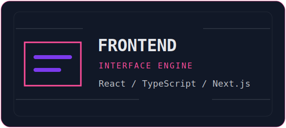
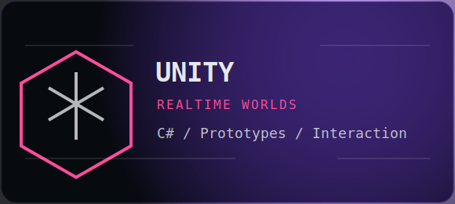
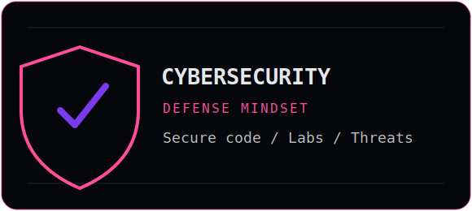
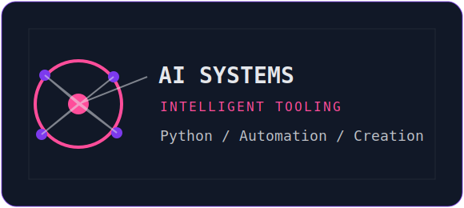
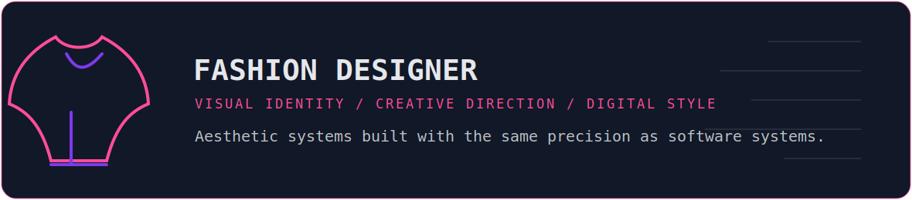
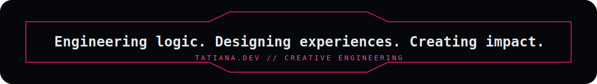

  

  

##  About

<table>
  <tr>
    <td width="50%">
      <h3>TATIANA / CREATIVE ENGINEERING PROFILE</h3>
      
I design and engineer digital experiences where logic, interface design, immersive systems, security awareness, and visual culture converge.

      
My work lives between frontend development, Unity experiences, cybersecurity practice, artificial intelligence exploration, and fashion-driven creative direction.

    </td>
    <td width="50%">
      <h3>ACTIVE MODULES</h3>
      
<strong>Frontend Developer</strong> - polished interfaces, responsive systems, and modern web architecture.

      
<strong>Unity Developer</strong> - interactive worlds, prototypes, gameplay systems, and real-time experiences.

      
<strong>Systems Engineer</strong> - structured problem solving, automation, security, and scalable thinking.

    </td>
  </tr>
</table>

##  Mission

<table>
  <tr>
    <td align="center" width="33%"><h3>Build</h3>
Ship refined products with clean architecture, fast interaction, and interfaces that feel intentional.
</td>
    <td align="center" width="33%"><h3>Protect</h3>
Think like an attacker, design like a guardian, and keep security present from the first decision.
</td>
    <td align="center" width="33%"><h3>Create</h3>
Merge engineering, fashion, AI, and immersive technology into memorable digital identities.
</td>
  </tr>
</table>

##  Technology Icons

  

##  Featured Areas

<table>
  <tr>
    <td width="50%"></td>
    <td width="50%"></td>
  </tr>
  <tr>
    <td width="50%"></td>
    <td width="50%"></td>
  </tr>
  <tr>
    <td colspan="2"></td>
  </tr>
</table>

##  Tech Stack

<table>
  <tr>
    <td align="center"><strong>React</strong> Interface Core</td>
    <td align="center"><strong>TypeScript</strong> Typed Logic</td>
    <td align="center"><strong>Next.js</strong> Web Runtime</td>
    <td align="center"><strong>Node.js</strong> Backend Tools</td>
  </tr>
  <tr>
    <td align="center"><strong>Unity</strong> Realtime Worlds</td>
    <td align="center"><strong>C#</strong> Gameplay Systems</td>
    <td align="center"><strong>Python</strong> Automation + AI</td>
    <td align="center"><strong>Git</strong> Version Control</td>
  </tr>
  <tr>
    <td align="center"><strong>GitHub</strong> Collaboration</td>
    <td align="center"><strong>Docker</strong> Containers</td>
    <td align="center"><strong>AWS</strong> Cloud Layer</td>
    <td align="center"><strong>Figma</strong> Design Systems</td>
  </tr>
  <tr>
    <td align="center" colspan="4"><strong>GitHub Actions</strong> Automated delivery, profile animation, and daily system refreshes.</td>
  </tr>
</table>

##  GitHub Stats

  
  

##  Top Languages

  

##  Current Objectives

<table>
  <tr>
    <td align="center" width="25%"><h3>01</h3>
Craft high-quality frontend interfaces with motion, accessibility, and design precision.
</td>
    <td align="center" width="25%"><h3>02</h3>
Prototype interactive Unity experiences that connect gameplay logic with visual storytelling.
</td>
    <td align="center" width="25%"><h3>03</h3>
Grow practical cybersecurity skill through labs, secure coding habits, and threat modeling.
</td>
    <td align="center" width="25%"><h3>04</h3>
Explore AI-assisted creation for systems, fashion concepts, and next-generation digital tools.
</td>
  </tr>
</table>

##  Featured Projects

<table>
  <tr>
    <td width="33%"><h3>NEON.UI</h3>
Frontend experiments focused on glassmorphism, HUD layouts, responsive components, and elegant interaction.
</td>
    <td width="33%"><h3>UNITY.LAB</h3>
Realtime prototypes for game mechanics, world interaction, spatial interfaces, and immersive storytelling.
</td>
    <td width="33%"><h3>SECURITY.NODE</h3>
Cybersecurity notes, labs, automation scripts, and secure engineering practice in progress.
</td>
  </tr>
  <tr>
    <td width="33%"><h3>AI.STUDIO</h3>
AI workflows for ideation, coding assistance, creative tooling, and intelligent product experiences.
</td>
    <td width="33%"><h3>FASHION.SYSTEMS</h3>
Digital fashion concepts connecting styling, visual identity, interface mood, and technology.
</td>
    <td width="33%"><h3>TATIANA.DEV</h3>
A living profile repository designed as a futuristic interface for creative engineering.
</td>
  </tr>
</table>

##  Contribution Snake

  

##  Contact

<table>
  <tr>
    <td align="center" width="33%"><a href="https://github.com/tatyjah"><strong>GitHub</strong></a> System repository and code experiments.</td>
    <td align="center" width="33%"><a href="https://www.linkedin.com/in/tatyjah"><strong>LinkedIn</strong></a> Professional network and project updates.</td>
    <td align="center" width="33%"><a href="mailto:tatyjah@example.com"><strong>Email</strong></a> Open channel for collaboration.</td>
  </tr>
</table>

  

